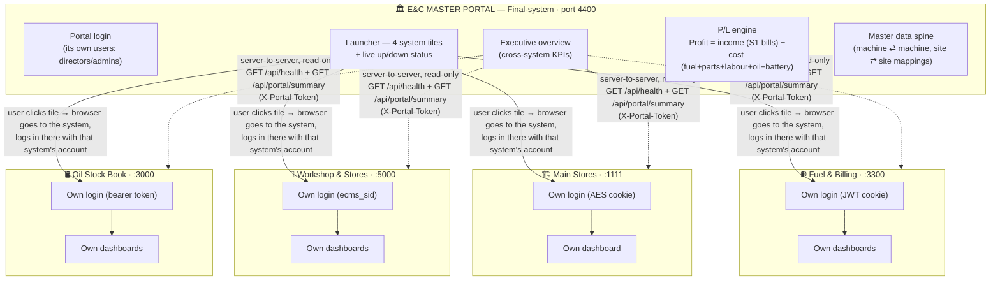
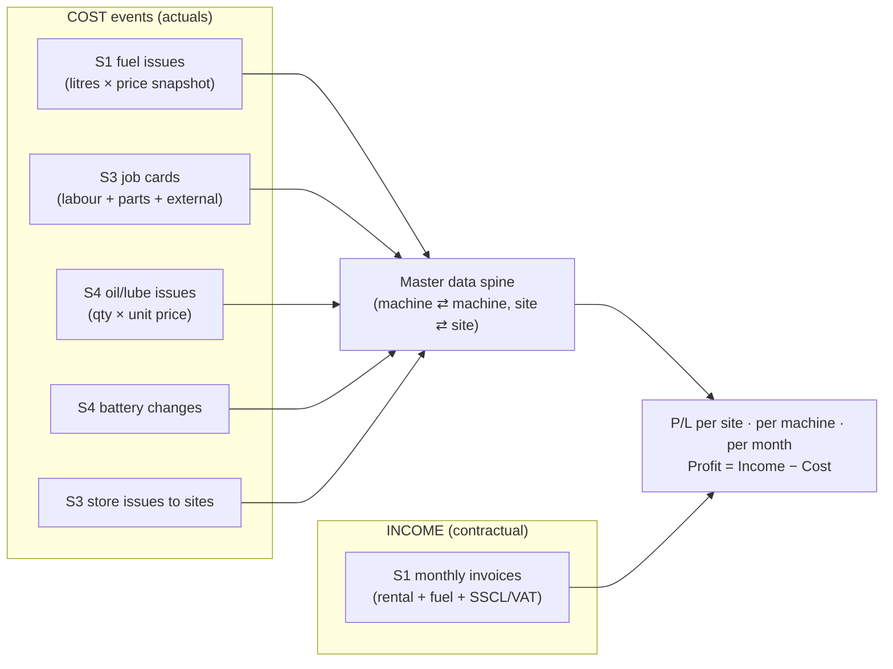

# E&C Super Master System — Master Plan

**Edward & Christie (Pvt) Ltd — one front door over four systems: ⛽ Fuel · 🏗️ Main Stores · 🔧 Workshop & Stores · 🛢️ Oil Stock Book**

_One portal that links every system the company runs — **separate logins, separate dashboards** for each system, plus the two things no single system can show today: the whole company at a glance, and **profit per site and per machine** (income billed vs true cost)._

- Home of the Super Master Portal: `yohan114/Final-system` (this repository)
- Linked systems: `yohan114/Fuel-System-V2` · `yohan114/Main-stros-system` · `yohan114/Store-Database` · `yohan114/oil-stock-book`
- Date: 2026-07-05
- Status legend: ✅ **Verified in code** · 🔜 **Next up** · ○ **Planned** · ⚠️ **Must fix first**

---

## 1. Executive summary

Edward & Christie now runs **four working systems**, each with its own users, database, login and dashboard. They already cover the whole operation — fuel & billing, machine/tool movements, stores & workshop costing, and the lubricant stock book — but they are four separate front doors on four ports, and nothing shows the company as a whole.

The **Super Master System** adds a fifth, thin application — the **E&C Master Portal** — that becomes the single entry point:

1. **One address for everything.** Staff open the portal, see a tile for each system, and click through to the system they work in. **Each system keeps its own login page, its own accounts, and its own dashboard — exactly as they are today.** The portal never shares sessions between systems.
2. **Live status at a glance.** The portal shows whether each system is up, and (phase M2+) headline numbers pulled from each one — fuel spend this month, pending MRNs, open job cards, low oil stock.
3. **A master overview no system can produce alone.** Because the same machines and sites appear in all four systems under different identifiers, the portal builds the **master data spine** (one canonical machine list, one canonical site list, with mappings) and then answers the question the directors actually ask: *"what did this machine / this site really cost this month — fuel + parts + labour + oil together?"*
4. **Profit, not just cost.** The Fuel system already produces the income side — monthly rental + fuel invoices per machine and site. Once the spine links each machine's costs across the four systems, the portal computes what no spreadsheet ever managed reliably: **Profit = income billed − true cost** (fuel + parts + labour + oil + batteries), per site, per machine, per month — with the fuel-margin and repair-burden split visible (§4.4).

The portal is **read-only toward the four systems**. It links, monitors and aggregates; it never edits their data. All entry and approval work stays inside each system, under that system's own roles.

> **Guiding principle (per the owner's brief): link everything into one system, but keep separate logins and separate dashboards.** The design below takes that literally: four sovereign systems, one master portal above them.

**Design principles applied throughout** (they already hold inside the four systems; the portal extends them across systems):

1. **Event-driven.** Every cost-bearing action — a fuel issue, an oil issue, a GRN/MRN line, a job-card labour line, a battery change — is already a time-stamped event with who / what / where / quantity / price in its home system. The portal never invents numbers; it aggregates those events.
2. **Cost flow, not stock count.** Track where value went (main store → site → machine → job card → bill), not just what is left on the shelf — that is what makes per-site and per-machine P/L possible.
3. **One system of record per domain.** Fuel events live in S1, machine movements in S2, parts & labour in S3, lubricants in S4 — and the portal's mapping spine is the single source of truth for *identity* (which machine is which, which site is which). No fact is mastered in two places — which is exactly why decisions Q2–Q4 must be answered.
4. **Cost and billing stay separate.** Costs come from actual purchase/issue prices and job cards; income comes from contract rate cards (S1's `RentalRate`) and invoices. The two meet only in the profit report — never in one table.
5. **Corrections, never overwrites.** S1 already enforces admin-approved corrections with signed documents; the portal inherits the rule — its mapping edits and snapshots are audit-logged, and it has no write path into the four systems at all.
6. **Machine-picked prices.** The cost on every issue is chosen by the system (price snapshot at issue in S1; GRN-derived prices in S3/S4), never typed from memory — the precondition for a bill anyone can trust.

---

## 2. The four systems today — verified from code

Every row below was confirmed by reading the actual repositories on 2026-07-05, not the planning documents.

| # | System | Repo | Domain it owns | Tech | Port | Login mechanism | Roles | Maturity |
|---|--------|------|----------------|------|------|-----------------|-------|----------|
| S1 | **Fleet Fuel & Billing Portal** | `Fuel-System-V2` | Fuel requests → issues, bulk tanks, meter readings, breakdowns, service planner + PM tasks + filter DB (July merge), monthly rental+fuel invoicing (SSCL/VAT, PDF/XLSX, email) | Next.js 16 · Prisma 7 · SQLite | **3300** (proxied at `fuel-portal.ec-workshops.online` / :6600) | `session` cookie — HS256 JWT (jose), bcrypt, 7-day | ADMIN · ALLOCATOR · USER (site PM) · WORKSHOP | ✅ Mature: 16 migrations, months of real 2026 site data, 10 vitest suites, CI green |
| S2 | **Main Stores Console** | `Main-stros-system` | Machine & tool lifecycle: MRN request → Head-Office approval → workshop receipt → dispatch to site (Transfer Note) → return, with mandatory photo/video evidence + machine register | Next.js 16 · Prisma 7 · SQLite | **1111** | `session` cookie — AES-256-GCM blob, PBKDF2, 7-day | ADMIN · HEADOFFICE · SK · VIEWER | ⚠️ Fresh v1: single commit, no tests, no migrations (`db push`), no backups, not yet deployed |
| S3 | **Workshop & Stores Unified System** | `Store-Database` | Stores (MRN materials, GRN receiving + pricing, issues, batteries, transfers, supplier spend) + Workshop (job cards, daily programme labour, per-job cost cockpit) + Operations approval workflow | Express · better-sqlite3 | **5000** (binds 0.0.0.0) | `ecms_sid` cookie — DB-backed session, scrypt, 7-day | ADMIN · TRANSPORT_OFFICER/MANAGER · OPERATIONAL_MANAGER · ASST/MECH_ENGINEER · TECHNICIAN | ✅ Mature & hardened: 82 API endpoints, `/api/health`, CI, ~3.6k MRN lines / 3.3k job cards of costed history |
| S4 | **Oil Stock Book** | `oil-stock-book` | Lubricant/consumable stock ledger with running balances, per-machine & per-project consumption, stock-take, requisitions (site → store → confirm), battery register with photos | Express · node:sqlite · React/Vite SPA | **3000** | `Authorization: Bearer` token (localStorage `osb_token`), scrypt, 30-day | admin · storekeeper · manager (project-scoped) | ✅ Feature-complete v2, actively developed to 2026-06-19; no tests/CI |

**Existing shared concepts** (the raw material for the master overview):

- **Machines** — S1 `Asset.code` (E&C code, e.g. `DT-123`) · S2 `Machine.code` (serial/plate) · S4 `fleet_assets.ec_code` (412 machines) · S3 `vehicleMachinery` (free text, no master table)
- **Sites/Projects** — S1 `Project` (unique code) · S2 `Site` (unique name) · S4 `projects`+`sites` · S3 `projectName`/`site` (free text). Real sites (Badalgama, Marawila, Ruwanwella, CEP-03…) appear in several systems under different spellings.
- **Users** — four independent user tables, four credential schemes. The same storekeeper may hold 3–4 accounts. (This stays — separate logins are a feature here, not a bug — but usernames should be kept aligned so SSO remains possible later.)

---

## 3. What the code scan corrected (truth vs the planning documents)

The uploaded plans describe intent; the code says what is real. The portal plan is built on the code.

| Claim in documents | Reality in code | Consequence for this plan |
|---|---|---|
| *SYSTEM_PLAN.md*: the Oil Stock Book was "absorbed" into Fuel-System-V2 (`npm run seed:oil`, Product/StockMovement models, TCO report) | ❌ **Not implemented.** Fuel-System-V2's Prisma schema (28 models) has **no** stock ledger, requisition, stock-count, battery or product models; no oil-stock code exists in the repo | The Oil Stock Book remains a sovereign system of record and gets its **own tile and login** in the portal. Its actual merge into S1 is a separate, optional future project (§8 Q3) |
| One stores system | **Two stores systems overlap**: S3 (mature, materials/GRN/costing) and S2 (new, machine & tool movements) both implement an MRN lifecycle with independent MRN number sequences | Portal treats them as two tiles with a **declared boundary** (recommended: S2 = machines & tools with photo evidence; S3 = consumable materials, GRN pricing, workshop costing) — see §8 Q2 |
| Batteries tracked once | **Two battery registers**: S3 `batteries`+`battery_movements` and S4 `batteries`+`battery_events` (photos, append-only audit) | One must be declared canonical (recommended: S4) — see §8 Q4 |
| Workshop service history in one place | S1 now holds service records/PM tasks (July merge) **and** S3 holds job cards + labour + per-job cost; same fleet, no cross-references | Master overview must show both, joined through the machine mapping — never summed blindly (double-count risk) |

---

## 4. Target architecture

### 4.1 The shape



- **Separate logins, by design.** Clicking a tile is a plain navigation to that system's own address. The user signs in there with that system's account and sees that system's dashboard, untouched. The portal never proxies authenticated pages and never shares cookies or tokens between systems.
- **The portal has its own small login** (directors, GM, IT admin) protecting the executive overview. Field staff who only use one system never need a portal account — they can bookmark their system directly or pass through the public launcher page.
- **All cross-system reads are server-to-server.** The portal's backend calls each system's read-only summary endpoint with a per-system secret header. No CORS is needed anywhere (none of the four systems has CORS today, and none will need it), and no system's session model changes.

### 4.2 The integration contract (what each system adds — and nothing more)

Each of the four systems gets two small, token-authenticated, **read-only** endpoints. S1 already proves the pattern (`/api/cron/billing` authenticates via an `x-cron-secret` header); we clone it as `x-portal-token` checked against a per-system `PORTAL_TOKEN` env var.

| Endpoint | Auth | Returns | Exists today? |
|---|---|---|---|
| `GET /api/health` | none | `{ ok, system, version, time }` | ✅ S3, ✅ S4 · ○ add to S1, S2 (M1) |
| `GET /api/portal/summary` | `x-portal-token` header | Compact JSON KPI snapshot (see below) | ○ add to all four (M2) |
| `GET /api/portal/costs?month=YYYY-MM` | `x-portal-token` header | Month-scoped cost events per machine/site — `{ occurredAt, machineRef, siteRef, category, qty, amountCents, sourceRef }` — feeds the P/L ledger (§4.4) | ○ add to S1, S3, S4 (M5) |

Per-system summary payloads (all figures the systems already compute for their own dashboards):

- **S1 Fuel** — litres & fuel cost this month, pending fuel requests, bulk-tank levels, bills by status (DRAFT/ISSUED/PAID/OVERDUE) + receivables total, service due/overdue count, breakdown "down now" count, open alerts.
- **S2 Main Stores** — requests by status (PENDING/APPROVED/RECEIVED/SENT_TO_SITE/RETURNED/IN_REPAIR), machines by status (WORKSHOP/SITE/REPAIR) and condition, awaiting-Head-Office-approval count.
- **S3 Workshop & Stores** — month/YTD spend split Local vs Head Office, pending MRN lines, open/in-progress job cards + month job cost, pending operations job-requests by stage, battery & transfer counts.
- **S4 Oil Stock Book** — stock value, products at/under reorder level, month issues by top consumers, pending requisitions, stock-take overdue flag, forecast run-outs.

Notes that keep this honest on Next.js 16: **both Next apps' `proxy.ts` matchers exempt `/api` entirely**, so these new routes must self-authenticate inside the handler (check the header, return 401 otherwise) — the same way S1's cron route already does. In S3 and S4 the routes mount *before* the session/bearer middleware, alongside their existing public `/api/health`.

### 4.3 The portal application (this repository)

Kept deliberately boring and consistent with the house stack:

| Layer | Choice | Why |
|---|---|---|
| Framework | **Next.js 16 (App Router)** + React 19 + TypeScript | Same stack as S1/S2 — one set of conventions (`src/proxy.ts`, Server Actions) |
| Database | **SQLite** via Prisma 7 + better-sqlite3 adapter | Same pattern as S1; stores portal users, system registry, mapping tables, KPI snapshot cache |
| Auth | JWT (`jose`) in an httpOnly cookie named **`portal_session`** | Same proven pattern as S1 — but a **unique cookie name** (see §5 collision) and its **own** `PORTAL_AUTH_SECRET` |
| Styling | Tailwind CSS 4, dark operations theme | Matches the family look |
| Port | **4400** | Free on the box (3000/1111/3300/5000/6600 are taken); never rely on Next's default 3000 — the Oil Book owns it |

Portal data model (small on purpose):

```
PortalUser      — username, name, passwordHash, role (MASTER_ADMIN | DIRECTOR | VIEWER)
System          — key (fuel|mainstores|workshop|oilbook), display name, baseUrl, healthPath, summaryPath, tokenRef, enabled
StatusSample    — systemId, at, ok, latencyMs            (health history → uptime strip per tile)
KpiSnapshot     — systemId, at, payload JSON             (last-known-good summary; portal still renders when a system is down)
MachineMap      — canonicalCode (E&C code) ⇄ s1AssetId? · s2MachineCode? · s4EcCode? · s3NamePatterns[]
SiteMap         — canonicalSite ⇄ s1ProjectCode? · s2SiteName? · s4ProjectId? · s3NamePatterns[]
CostEvent       — systemKey, sourceRef (unique per system → idempotent re-ingest), occurredAt,
                  machineCode?, siteKey?, category (fuel|parts|labour|oil|battery|store|external),
                  qty?, amountCents, mapped flag                    (the normalized cost ledger, §4.4)
AuditLog        — portal actor/action trail (logins, mapping edits, token changes)
```

Portal screens:

- `/` — **Launcher**: four tiles (name, icon, up/down dot, 24-h uptime strip, 3–4 headline KPIs, "Open system →" link). Public or portal-login-gated — owner's choice (§8 Q5).
- `/login` — portal sign-in (portal accounts only).
- `/overview` — **Executive overview** (portal login): company-wide KPI wall — fuel spend, stores spend, workshop job cost, oil stock value, receivables, alerts rollup — each figure linking out to the owning system's own screen for drill-down.
- `/profit` — **P/L board** (portal login, from M5): per-site and per-machine monthly profit — income from S1 invoices vs cost by category (fuel, parts, labour, oil, battery), fuel-margin and repair splits, an explicit "unattributed" bucket for unmapped events, month selector, CSV export.
- `/machines` + `/machines/[code]` — the **master machine register**: one row per physical machine (canonical E&C code) with per-system presence and, once mapped, the combined monthly cost view (fuel from S1 + parts/labour from S3 + oil from S4 + movement status from S2).
- `/sites` — same idea per site/project.
- `/admin/systems`, `/admin/mappings`, `/admin/users`, `/admin/audit` — registry, mapping workbench (with fuzzy-match suggestions for S3's free-text names), portal users, audit.

### 4.4 Cost & profit model — from events to P/L

The four systems already record every cost-bearing event. The portal normalizes them into one read-only ledger and sets them against the income S1 already bills:



- **Cost side (actuals):** `CostBill(site, month) = Σ fuel issued (at issue-price snapshot) + Σ oil/lubes issued + Σ store items issued + Σ job-card costs (labour + parts + external) + Σ battery replacements`. Every term is an **existing event** in S1/S3/S4, attributed to a machine and site through the spine — the portal computes, it never re-enters.
- **Income side (contractual):** S1's issued invoices per machine and site (rental from `RentalRate` cards + fuel + taxes) — already immutable snapshots in S1.
- **Profit:** `Profit(site, month) = Income(site, month) − CostBill(site, month)`, and the same per machine — with the split visible: fuel margin (fuel billed vs fuel cost), repair burden, oil burden. **Cost per km / per hour** falls out free wherever S1 meter readings exist for the machine.
- **Honesty rules:** (a) a repair can appear both as an S3 job card and an S1 service record — the ledger tags provenance, and the P/L never sums both maintenance sources for one machine without the Q2/Q4 boundary declaring which is authoritative; (b) events that can't be attributed to a mapped machine/site land in a visible **"unattributed" bucket**, so the P/L always states its own coverage instead of silently under-counting; (c) all money stays in **LKR cents (integers)**, matching S1's convention.

### 4.5 Routing & addressing — one main link, four subs *(shipped)*

Evidence in the code favors subdomains over path-prefixes, strongly:

- `*.ec-workshops.online` is already provisioned and whitelisted in S1's `serverActions.allowedOrigins`; a reverse proxy already fronts S1 (`fuel-portal.ec-workshops.online`, local :6600).
- Path-prefix routing on one hostname is **blocked by real collisions**: S1 and S2 both set a cookie literally named `session` at `path=/` (they would log each other out on every sign-in); `/api` is claimed by all four apps; `/uploads` by two; and S4's SPA hardcodes the `/api` prefix, so path-mounting it requires a rebuild.

**Chosen structure — the portal is the one main link, each system a sub-domain *of it*** (so the estate is a single visible hierarchy, not five sibling hosts):

| Address | → | System |
|---|---|---|
| `portal.ec-workshops.online` — **main** | :4400 | **Master Portal** (this repo) |
| `fuel.portal.ec-workshops.online` | :3300 | Fuel & Billing |
| `stores.portal.ec-workshops.online` | :1111 | Main Stores Console |
| `workshop.portal.ec-workshops.online` | :5000 | Workshop & Stores |
| `oil.portal.ec-workshops.online` | :3000 | Oil Stock Book |

Configured from **one value** — `PORTAL_PUBLIC_DOMAIN=portal.ec-workshops.online` — from which the portal seed derives every system's `openUrl` as `<sub>.<domain>`; the launcher shows each system's sub-host under its name so the hierarchy is visible. DNS is one wildcard record `*.portal.ec-workshops.online`; Caddy auto-issues a cert per named host (`deploy/Caddyfile`). Subdomains also give each system its own cookie scope, which is precisely what "separate logins" needs. (LAN-only fallback if public DNS is not wanted: same layout with internal DNS names or `hosts` entries — decision Q5.)

---

## 5. ⚠️ Security gate — must fix **before** the portal links anything

The scan found live issues that become more dangerous the moment one front door advertises all four systems. These are small fixes; do them first.

| # | System | Finding (verified in code) | Fix |
|---|--------|---------------------------|-----|
| G1 | S1 | `GET /api/reports/export/xlsx` is **completely unauthenticated** (proxy bypasses it and the handler never checks a session) — fleet-wide fuel data export on a public domain | Require a session (or portal token) in the handler |
| G2 | S2 | `POST /api/upload` has **no auth** (proxy matcher exempts `/api`) — anyone on the LAN can write files into `public/uploads` | Check the session cookie inside the handler |
| G3 | S4 | `/uploads/*` (battery photos) served statically with no auth | Gate behind the bearer middleware or move under `/api` |
| G4 | S1+S2 | Both read `process.env.AUTH_SECRET` and both ship hardcoded dev fallbacks (S2 also uses a static scrypt salt) — on one Windows box with machine-level env vars they'd silently share a secret | Distinct names (`FUEL_AUTH_SECRET`, `MAINSTORES_AUTH_SECRET`) or strict per-process `.env` files; remove/replace fallbacks; portal gets its own `PORTAL_AUTH_SECRET` |
| G5 | S1+S2 | Cookie name collision: both set `session` at `path=/` | Rename S2's to `mainstores_session` (one-line change; S2 has no deployed users yet). Portal uses `portal_session`. Subdomains then make this belt-and-braces |
| G6 | all | Default credentials: `admin/admin123` seeded in S2 (and **displayed on its login page**), S3, S4; S1 has a hardcoded fallback seed password; S3 approver accounts ship `changeme123` | Rotate every seeded account; remove the on-screen credentials in S2; set `SEED_*` envs on fresh installs |
| G7 | S1 | `requireUser()` has a `TEST_ENV === "true"` bypass returning the admin user | Ensure it can never be set in production (guard on `NODE_ENV`) |
| G8 | ops | All four SQLite DBs, all photo/document BLOBs **and all their backups** live on one disk of one Windows box; S2 has no backup at all | Off-machine backup (network share / USB rotation / cloud) as part of M6; add S2 backups |

---

## 6. Port, process & environment map (single source of truth)

| Port | Process | Start today | Target (M6) |
|---|---|---|---|
| 3000 | Oil Stock Book | `start_server.bat` | Supervised service |
| 1111 | Main Stores Console | — (not yet deployed) | Supervised service |
| 3300 | Fuel & Billing | `start-server.bat` | Supervised service |
| 5000 | Workshop & Stores | `start_server.bat` / startup script | Supervised service |
| 4400 | **Master Portal (new)** | — | Supervised service |
| 6600/443 | Reverse proxy (fronts S1 today) | running | Fronts all five hosts + TLS |

Rules: every app keeps an **explicit** `-p`/`PORT` (never Next's default 3000 — S4 owns it); one supervisor (NSSM / Windows services) restarts everything on crash or reboot; the portal polls `/api/health` so a dead process is visible within a minute instead of when a user complains.

Per-system env vars the portal work introduces: `PORTAL_TOKEN` (unique per system, referenced by the portal's `System.tokenRef`), plus the renamed auth secrets from G4/G5.

---

## 7. Roadmap — seven phases to hero

> **Status (2026-07-05): M0–M6, M8 (unified server) and M9 (one codebase) are shipped and runtime-verified**, plus most of M7. Everything now lives in **this one repository** (`apps/*` holds the four systems), deploys as **one Node process on one port**, and presents **one main link with four sub-domains**. Every phase was exercised in a real browser against live systems — not just typechecked. Next: M10 go-live (see the end of this section).

### M0 · Security gate ✅ Shipped
Applied G1–G7 across the four repos (G8 landed in M6). G1 auth on the open xlsx export, G7 TEST_ENV bypass gated on production, G4 system-scoped auth secrets, G5 renamed the colliding `session` cookie, G2/G3 auth on the open upload/uploads surfaces, G6 removed every hardcoded/on-screen default credential.
**Verified:** each fix exercised — e.g. `/api/reports/export/xlsx` and the S4 `/uploads` gate return 401 unauthenticated; S1 CI green.

### M1 · Portal MVP — one front door ✅ Shipped
Scaffolded this repo (Next.js 16 + Prisma + SQLite, port 4400). Portal login (`portal_session`, own `PORTAL_AUTH_SECRET`), `System` registry seeded with the four systems, **launcher with four tiles + live up/down** (added the trivial `/api/health` to S1 and S2). Tiles link out; each system's own login takes over.
**Verified:** 11/11 browser checks — unauthenticated redirect, admin login lands on the launcher, all four tiles render live health, bad password rejected, poll API 401s without a session.

### M2 · Integration contract — headline numbers on the tiles ✅ Shipped
Added `GET /api/portal/summary` (x-portal-token) to all four systems, cloned from S1's cron-auth pattern; portal poller stores `KpiSnapshot`s and renders 4 KPIs per tile with last-known-good on outage.
**Verified:** 6/6 against the live Oil Stock Book — token missing/wrong → 401; tile KPIs (below-reorder, out-of-stock…) render with correct tones.

### M3 · Executive overview ✅ Shipped
`/overview`: company KPI wall grouped by system with an attention rollup (systems up N/M, warn/bad KPI count); each KPI deep-links into a verified route in the owning system. No cross-system sums (that's M4).
**Verified:** 10/10 — wall renders, rollup counts, deep-links resolve to `/ledger` and `/requisitions`.

### M4 · Master data spine — the keystone ✅ Shipped
`MachineMap`/`SiteMap` + `SystemEntity` staging + mapping workbench: auto-match by E&C code (S1 `Asset.code`, S4 `ec_code`, S3 `ecdNo`), unmapped queue with fuzzy suggestions + manual link for S2 serial/plate and S3 free-text. `/machines`, `/machines/[code]` (one machine unified across systems), `/sites`.
**Verified:** live Fuel + Oil sync — 386 canonical machines; AP-08/BD-01/BD-02 auto-matched across both systems; 27 code-less assets queued as unmapped.

### M5 · Cost ledger & profit engine — the real prize ✅ Shipped
Added `GET /api/portal/costs?month=` (x-portal-token) to S1 (fuel + invoice income), S3 (labour + parts) and S4 (oil); the portal ingests through the spine into the idempotent `CostEvent` ledger; `/profit` board: per-site and per-machine P/L — income vs cost by category with an "unattributed" bucket and CSV export (§4.4).
**Verified:** hand-reconciled pilot — AP-08 at Badalgama, July 2026: income Rs 600,000 − fuel cost Rs 150,000 = profit Rs 450,000, matching to the rupee across totals, site row, machine row and CSV (10/10).

### M6 · Operations hardening ✅ Shipped
Portal `/alerts` (health history → prioritised feed, warning → critical after ~5 min down); `DEPLOYMENT.md` (port/env/subdomain map, startup order, supervision, backups); `deploy/Caddyfile` (reverse proxy + TLS), `deploy/ecosystem.config.js` (PM2), `deploy/backup-all.{ps1,sh}` (off-machine snapshots of all five DBs, closing G8); added `npm run backup` to S2 (the one system that lacked one).
**Verified:** alerts 7/7; backup script snapshotted the live DBs (fuel backup valid, AP-08 present) and the S2 backup produced a valid snapshot. *(Reverse-proxy/PM2 configs are committed artifacts; a reboot restore-drill is an on-site step.)*

### M7 · Future (separate approvals) ○ Planned
- ✅ **Fuel-margin split** *(shipped)* — the profit board now separates fuel billed vs fuel cost from rental profit: a fuel-margin headline card and a per-site/per-machine column. Income invoices are ingested split into rental / fuel / tax. Verified on the pilot (fuel billed Rs 180k − fuel cost Rs 150k = +Rs 30k margin, overall profit unchanged).
- ✅ **Alert email digest** *(shipped)* — the portal composes its alerts feed into an email: an `Outbox`-recorded digest sent via SMTP (or "simulated" when SMTP isn't set), a `Send digest now` button on `/alerts`, and a `CRON_SECRET`-authed `/api/cron/alert-digest` for a scheduler. Verified (401 without token; composes + records a 4-alert critical digest with it).
- ✅ **Battery lifecycle in S4** *(shipped)* — the battery register now records installed date + warranty months + unit cost, derives a warranty status (ok / expiring within 60 days / expired), shows it on the card, and exposes `GET /api/batteries/alerts` (expired + expiring, worst-first). Verified via the API (8/8).
- ✅ **Battery cost category** *(shipped)* — S4's cost feed now emits battery replacements (unit cost, month installed) attributed to a machine by matching the battery's registration to a fleet E&C code; the profit board + CSV gain a Battery column. Verified live (BD-01 battery Rs 31k on the machine row; code-less battery correctly unattributed).
- ⏸ **Store cost category** — S3 store issues remain free-text-only (would land unattributed); revisit if S3 issues gain an E&C-code link.
- **Single sign-on** — only if wanted later; the groundwork (aligned usernames, per-app secrets, subdomain cookies) is deliberately laid so SSO is an add-on, not a rewrite. Until then: separate logins, as specified.
- **Stores boundary execution** (per Q2): keep S2 and S3 with the declared split, or fund a real migration.
- **Oil-book merge into S1** (per Q3) — the merge SYSTEM_PLAN.md described, actually executed, if ever justified; the portal tile means there is no urgency.
- **Battery register consolidation** (per Q4); alert email digest from the portal; portal PWA for phones.
- ✅ **Site fuel discipline in S1** *(shipped — daily litre cap)* — assets now carry an optional per-vehicle `dailyCapLitres`; a `checkDailyCap()` gate sums the vehicle's non-voided litres for the calendar day and blocks any issue that would push the day's total past the cap. Enforced in **both** fuel-out paths (direct issue + request approval), ahead of pricing so nothing is written when blocked; the cap is editable on the create/edit asset forms (blank = no limit). Verified against the real DB (at-cap allowed, over-cap blocked, voided + prior-day excluded, null = unlimited) and end-to-end over HTTP (cap set via the edit form persists across reload; an over-cap request approval stays PENDING with no issue created). *Per-site allowed-vehicle lists remain a future add-on.*
- **Battery lifecycle depth in S4** — warranty period, expected-replacement-date alerts, and warranty-claim tracking on the existing photo register.

### M8 · Unified server ✅ Shipped

**One Node process hosts the whole estate** — chosen because the production VPS
can't run five separate services. `Final-system/server/unified.mjs` boots the
portal plus all four systems inside a single process on one port (4400):

- The three Next.js apps boot via the custom-server API (`next({ dir })`), each
  from **its own directory and node_modules**; the two Express apps export
  their `app` (listen is skipped when embedded). Every system keeps its own
  login, dashboard and database — nothing was merged.
- **Routing**: by leftmost host label — `fuel.` / `stores.` / `workshop.` /
  `oil.` → that system; any other host → the portal. Server-to-server polling
  uses the in-process channel `/__sys/<key>/api/*` (API-only; pages are
  host-routed only).
- **Env de-collision**: per-app DB URLs (`PORTAL_/FUEL_/MAINSTORES_DATABASE_URL`,
  derived absolute automatically), and every system now prefers
  `<SYS>_PORTAL_TOKEN` — in unified mode one variable per system configures
  both sides of the token pair. The unified server loads `Final-system/.env`
  first (authoritative), then each app's own `.env` without overriding.
- **Resilience**: a system that fails to boot serves 503 and shows red on its
  tile; the rest of the estate keeps running. PM2 supervises the one process
  (`deploy/ecosystem.config.js`); Caddy proxies all five hosts to :4400.
- **Verified end-to-end** in one process (~430 MB RSS): host routing returns
  each system's own `/api/health` (5/5), the `/__sys` channel serves all four
  token-authed summaries (bad token 401, non-API 404, portal-via-channel 404),
  and in a real browser: portal login + **all four tiles Up with live KPIs**,
  Fuel login through its sub-host, and each sub-host serving its own system
  (7/7 checks).

### M9 · One codebase ✅ Shipped

**All systems now live in ONE repository** — this repo. The four apps moved
into `apps/{fuel,stores,workshop,oilbook}` (tracked files imported from each
repo's merged `main`; full history stays in the original repos, which can be
archived once this merges):

- The unified server resolves `apps/*` automatically (explicit `<SYS>_APP_DIR`
  still wins; the old sibling-checkout layout remains a fallback).
- `deploy/setup-vps.sh` now clones **one repo** instead of five.
- CI consolidated: root workflow runs the portal typecheck, Fuel's
  lint/typecheck/tests, and Workshop's full build-and-test — each inside its
  app folder.
- Each Next app pins `turbopack.root`; the portal's tsconfig excludes `apps/`.
- **Security fix found during the move:** the old Fuel repo had tracked its
  live SQLite database (`data/app.db` + WAL/SHM — real fleet data and password
  hashes) since its first commit. The monorepo excludes them and ignores
  `/data/app.db` explicitly; archiving the old repos closes the exposure.
- **Verified in the new layout**: unified boot from `apps/*` with no env
  overrides, host routing 5/5, `/__sys` channel + guards, browser suite 5/5
  (portal tiles all Up, Fuel login via sub-host), and Workshop's suite from
  `apps/workshop` — 9 unit + 113 API tests, 0 failures.

### M10 · Go-Live ○ Next (the remaining stages)

1. **M10 · Go-live on the VPS** — DNS (`portal.…` + `*.portal.…` → VPS), run
   `deploy/setup-vps.sh`, copy the real database files in, rotate every seeded
   password, start Caddy. *Exit: all four tiles green on the live portal with
   real data.*
2. **M11 · Trust & safety net** — schedule `deploy/backup-all.*` off-machine
   plus one restore drill; set `SMTP_*` so the alert digest actually emails;
   work the master-data unmapped queue to zero. ✅ *Backup-staleness alerts
   shipped:* every system reports its newest on-disk backup with its KPI
   summary (app-dir-relative, so unified mode is safe); the portal warns at
   48 h / goes critical at 7 days / flags "no backup", on /alerts and in the
   digest. Verified live: a 3-day-old fixture raised the stale warning, a
   missing backups dir raised "has no backup", fresh backups stayed quiet
   (5/5 browser checks; legacy array snapshots parse untouched).
3. **M12 · Depth (separate approvals)** — per-site allowed-vehicle fuel
   lists; portal PWA; battery warranty claims; store cost category once S3
   issues carry an E&C code. ✅ *Single sign-on shipped:* sign in once at the
   portal and "Open system" arrives already signed in. The portal's
   `/launch/<key>` mints a 60-second single-use HMAC token (per-system
   `<SYS>_SSO_SECRET`, both sides read the same variable in unified mode);
   each system's `/sso` endpoint verifies it (timing-safe, expiry, one-time
   jti, audience check) and mints its own native session for the matching
   local username — S1/S2 set their cookies, S3 its DB session, S4 hands the
   bearer token to the SPA via a stripped `#sso=` hash. Local accounts, roles
   and logins are untouched; unset secret = SSO off for that system. Verified
   end-to-end in a real browser (13/13): all four systems open signed-in from
   one portal login, plus no-session, tampered-token, expired, replayed and
   wrong-audience tokens all rejected to the login page.

---

## 8. Decisions (answered "all recommendations" — M0–M6 built on these)

> These were the pre-build decisions. Implementation proceeded on the recommended option for each. They remain the reference for the choices baked into the platform (and Q2–Q4 stay live for M7).

- **Q1 · Routing:** ✅ *Decided — nested sub-domains.* The portal is the one main link (`portal.ec-workshops.online`) and each system opens on a sub-domain **of it** (`fuel.portal…`, `stores.portal…`, `workshop.portal…`, `oil.portal…`), configured from a single `PORTAL_PUBLIC_DOMAIN` value. (Path-routing on one host stays ruled out by the cookie/`/api`/`/uploads` collisions; LAN-internal hostnames remain the offline fallback — Q5.)
- **Q2 · Stores boundary:** declare **S2 = machines & tools movements (photo evidence), S3 = consumable materials, GRN pricing & workshop costing** and show both tiles (**recommended**) — or plan a merge (large: S3 holds ~3.6k costed MRN lines; S2 has no tests yet)?
- **Q3 · Oil Stock Book:** keep as sovereign system of record with its own tile (**recommended**; the "absorbed into Fuel" plan was never implemented) — or fund the actual merge first (defers the portal by weeks)?
- **Q4 · Canonical battery register:** Oil Stock Book (**recommended** — photos + append-only audit + one-battery-per-vehicle constraint); S3's battery screens become read-only/retired later.
- **Q5 · Exposure:** portal LAN-only, or public behind TLS like `fuel-portal`? Also: is the launcher page public with only `/overview` behind portal login (**recommended**), or everything behind login?
- **Q6 · Portal accounts:** who gets one? (Recommended: directors + GM + IT admin only; field staff keep using their own system logins and never need the portal.)
- **Q7 · Costing method for store items:** **weighted-average cost at issue** for S3/S4 store items (**recommended** — the simplest defensible method, and S1's fuel already does better: an exact price snapshot at every issue) — or FIFO cost layers (more precise, more machinery)?

_Decided: **all recommendations**. M0–M6 are built and verified on these choices; see §7 for per-phase delivery + verification. The remaining open questions (Q2–Q4) gate only the optional M7 depth items._

---

## 9. How the work is done

Same discipline as every E&C system so far:

**Plan → owner approves → build one step → runtime-verify against the real systems → commit per step → CI green.**

Portal code lives in this repository. The four system repos receive only their small, reviewed additions (health route, summary route, security-gate fixes) on their own branches — the portal never reaches into their databases directly.

---

## Appendix A — System fact sheets (condensed from the 2026-07-05 code scan)

### S1 · Fuel-System-V2 — Fleet Fuel & Billing Portal
Next.js 16.2.7 · Prisma 7.8 + better-sqlite3 · port 3300 · DB `data/app.db` (WAL, 16 migrations, nightly backup script + admin UI). Auth: `session` httpOnly cookie, HS256 JWT (jose), bcrypt, 7 days; RBAC matrix in `src/lib/rbac.ts`; `src/proxy.ts` is the auth choke point (bypasses `/api/cron/*`, `/api/reports/export/*`). Roles ADMIN/ALLOCATOR/USER/WORKSHOP. ~30 screens: fleet, fuel requests/issues/corrections, integrity, allocator & workshop consoles, tanks, service planner + PM, breakdowns, filters, readings, reports, sites, analytics, billing + aging, alerts, admin suite. Machine endpoint pattern to clone: `/api/cron/billing` with `x-cron-secret`. Key models: User, Project, Asset (unique E&C code), AssetAssignment, FuelPrice/Request/Issue/Correction, MeterReading, BulkTank/TankDip, RentalRate, Bill/BillLineItem/CreditNote, Budget, ServiceRecord/ServiceInterval/PMTask, Filter/FilterCrossRef, DailyCondition, AuditLog, Setting.

### S2 · Main-stros-system — Main Stores Console
Next.js 16.2.9 · Prisma 7.8 + better-sqlite3 · port 1111 · DB `./dev.db` (no migrations — `db push`; no backups). Auth: `session` httpOnly cookie (⚠️ collides with S1), AES-256-GCM blob, PBKDF2-SHA512, 7 days; `assertRole()` per server action; forced password change on first login. Roles ADMIN/HEADOFFICE/SK/VIEWER. One-page dashboard (2,111-line component): REQUESTS tab (MRN pipeline PENDING→APPROVED→RECEIVED_WORKSHOP→SENT_TO_SITE→RETURNED_WORKSHOP/IN_REPAIR with timeline) + INVENTORY tab (machine register, sites); modals for receive/dispatch/return with mandatory photo/video. Sole API route `POST /api/upload` (⚠️ unauthenticated). Models: User, Site, Machine (code = serial/plate), MachineRequest (MRN), MediaFile.

### S3 · Store-Database — Workshop & Stores Unified System
Express 4 · better-sqlite3 (node:sqlite fallback) · port 5000 on 0.0.0.0 · DB `inventory.db` (WAL, versioned hand-rolled migrations, FK-emulation triggers, half-hourly online backups with tiered retention). Auth: `ecms_sid` cookie, DB-backed sessions, scrypt, 7 days; login rate-limiting; `requireRole()`; public `/api/health` ✅. Roles: ADMIN, TRANSPORT_OFFICER, TRANSPORT_MANAGER, OPERATIONAL_MANAGER, ASST_MECH_ENGINEER, MECH_ENGINEER, TECHNICIAN. ~82 JSON endpoints; SPA views: command-centre dashboard, MRN tracker, receiving, pricing, issues, inventory, fleet, batteries, transfers, job cards, daily programme, operations (JR-YYYY-NNNN workflow DRAFT→PENDING_TM→PENDING_OM→APPROVED→IN_PROGRESS→COMPLETED→CLOSED). `/api/summary` change-poll is a ready-made freshness signal for the portal. Data: ~3,638 MRN items, 2,918 receipts, 1,724 issues, 3,303 job cards. ⚠️ Vehicles & projects are free text — mapping tables needed (M4).

### S4 · oil-stock-book — Oil Stock Book
Express 4 · node:sqlite · React 18/Vite SPA served by the same process · port 3000 · DB `data/oilbook.db` (WAL, daily `VACUUM INTO` backups, keep 30). Auth: bearer token in localStorage (`osb_token`), server-side sessions 30 days, scrypt; public `/api/health` ✅ and `POST /api/auth/login`; per-route `requireRole('admin'|'storekeeper'|'manager')`; managers project-scoped via `user_projects`. Screens: dashboard, ledger, per-product book (printable), machines (412 fleet assets, abnormal-usage detection), projects, requisitions, batteries, stock-take, trends/forecasts, mapping (alias resolution — a mini version of exactly what the portal's M4 needs), settings, users. Models: products, transactions (running-balance ledger, over-issue guard), fleet_assets (ec_code), projects/sites, users, sessions, stock_counts, batteries/battery_events, requisitions, aliases, settings.

---

## Appendix B — Where the integrated-costing ideas landed

The owner supplied a design brief for a single integrated workshop + project costing system (event-driven tracking, cost flows, MRN/GRN, job cards, batteries, billing & profit). This plan adopts its substance while honoring the standing decision to keep four sovereign systems with separate logins. The mapping — nothing was ignored silently:

| Idea from the brief | Where it landed |
|---|---|
| Event-driven tracking (who / what / where / when / qty / price) | ✅ Already how all four systems record; elevated to **Design principle 1** (§1) |
| Cost flow main store → site → vehicle → job card → bill | ✅ **Design principle 2** + the §4.4 cost model |
| Single source of truth / one database, one login | ⚠️ **Adapted:** one system of record *per domain* + the portal spine as the single source of truth for identity (Design principle 3). A literal single database would mean rebuilding four working systems and contradicts the separate-logins brief |
| Cost bill per site vs income bill; **Profit = Income − Cost** | ✅ **Adopted wholesale** — §4.4 and phase M5. Income already exists (S1's invoices), so only the cost aggregation is new work |
| Fuel: purchase/GRN → stock → issue with automatic cost pick | ✅ Exists in S1 (price snapshot at every issue; bulk tanks + dip reconciliation); **Design principle 6** |
| Site-wise allowed fuel list + daily/weekly limits per vehicle | ✅ Per-vehicle **daily litre cap** shipped in **M7** (enforced on both fuel-out paths, ahead of pricing); per-site allowed-vehicle lists remain a future add-on |
| MRN/GRN with per-line pricing and traceability | ✅ Exists in S3 (receiving desk, pricing & audit view, stock-checked issue desk) |
| Item master with costing method per item | ⚠️ Partially exists (S3/S4 item catalogs with unit prices); the method question is **decision Q7** (weighted average recommended) |
| Job cards: labour + parts + external expenses; JobCost formula | ✅ Exists in S3 (`jobTotal = max(labour + parts + issues, recordedCost)`, per-mechanic labour rates) |
| Battery entity with images, install dates, replacement events | ✅ Exists in S4 (mandatory photo, append-only event audit, one live battery per vehicle); **warranty period / expected-replacement alerts / claims** adopted as an S4 enhancement in **M7** |
| Cost per km / per hour | ✅ Falls out of S1 meter readings once the spine joins costs to machines (§4.4) |
| Correction entries, never overwrites; audit trails | ✅ Exists (S1 approved corrections with signed documents; audit logs in all four); **Design principle 5** |
| Roles: main store / site supervisors / workshop / management | ✅ Exists per system (§2 role columns); the portal adds the management layer (**Q6**) |
| Start with one site and a few vehicles | ✅ Adopted as **M5's verification rule** — one pilot site reconciled by hand to the rupee before any other site's P/L is trusted |
| Strict coding standards (vehicle/item/site codes unique, never change) | ✅ That *is* the spine (**M4**) — the E&C code is the canonical machine key; free-text names in S3 get mapped, not renamed |
| Images in structured paths, store the path not the blob | ⚠️ Noted; S2 stores files under `public/uploads/<phase>_<uuid>` and S4 under `/uploads` — kept as-is, but both must be auth-gated first (**G2, G3**) |
| Tech options: Django/Flask or Node + PostgreSQL/MySQL; or Excel + scripts | ❌ **Rejected** — four production systems already run on Next.js/Express + SQLite with months of real 2026 data, tests and CI; rebuilding on a new stack (or regressing to spreadsheets) discards working software. Postgres stays a documented escape hatch if write-concurrency ever demands it (S3's own roadmap already says the same) |
| 2–3 week requirements phase before building | ⚠️ Adapted — the 2026-07-05 code scan (Appendix A) already did the discovery; §8's decision list is the only requirements work left, then M0 starts |

---

_Referenced planning documents: `ZERO_TO_HERO_PLAN.md` (S1 billing push), `SYSTEM_PLAN.md` (S1 platform design — note §3 corrections), `ROADMAP.md` (S3 zero→hero ladder), and the owner's integrated-costing brief (mapped above). This plan supersedes none of them; it adds the layer above._
